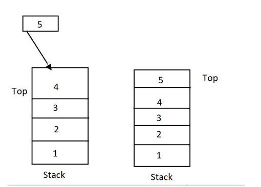

# In memory storage

## Understanding the JavaScript Call Stack

1. What is a ‘call’?
*The call stack is primarily used for function invocation (call).*
2. How many ‘calls’ can happen at once?
*one at a time*
3. What does LIFO mean?
*When we say that the call stack, operates by the data structure principle of Last In, First Out, it means that the last function that gets pushed into the stack is the first to be pop out, when the function returns.*
4. Draw an example of a call stack and the functions that would need to be invoked to generate that call stack.

5. What causes a Stack Overflow?
*A stack overflow occurs when there is a recursive function (a function that calls itself) without an exit point. The browser (hosting environment) has a maximum stack call that it can accomodate before throwing a stack error.*

## JavaScript error messages

1. What is a ‘refrence error’?
*when use a variable that is not yet declared*
2. What is a ‘syntax error’?
*when you have something that cannot be parsed in terms of syntax, like when you try to parse an invalid object using JSON.parse.*
3. What is a ‘range error’?
*Try to manipulate an object with some kind of length and give it an invalid length and this kind of errors will show up.*
4. What is a ‘tyep error’?
*when the types (number, string and so on) you are trying to use or access are incompatible, like accessing a property in an undefined type of variable.*
5. What is a breakpoint?
*The breakpoint can achieved by putting a debugger statement in your code in the line you want to break.*
6. What does the word ‘debugger’ do in your code?
*it will achieved the breakpoint*

## Things I want to know more about

- more about how to solve error
