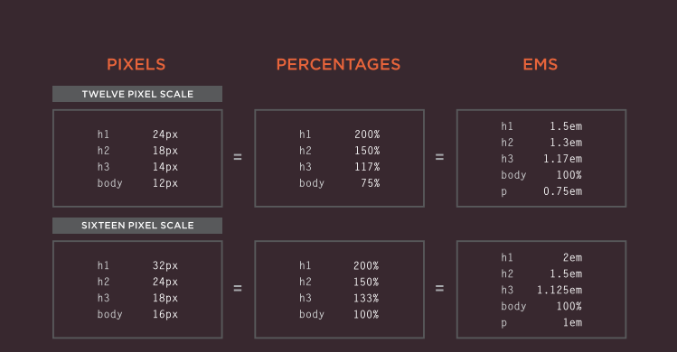

# Images, Color, Text

**intro:**
*we will talk about Images then about Color and text and in the end we will talk about JPEG vs PNG vs GIF  which image format to use and when?*
## Images
**adding Images:**
*``*
*To add an image into the page  you need to use an ``  element. This is an empty  element (which means there is  no closing tag). It must carry the  following two attributes:*
1. *`src`*
	*This tells the browser where it can find the image file. This  will usually be a relative URL  pointing to an image on your  own site.* 
2. *`alt`*
	*This provides a text description  of the image which describes the image if you cannot see it.*
	
+ *`title`*
	*You can also use the title  attribute with the `` element  to provide additional information  about the image. Most browsers  will display the content of this  attribute in a too tip when the  user hovers over the image.*

**Where to place Images In Your Code:**

1.  **before a paragraph:**
*The paragraph starts on a new  line after the image.*

2. **Inside the start of a  paragraph:**
*The first row of text aligns with  the bottom of the image.*

3.  **In the middle of a  paragraph:**
*The image is placed between the  words of the paragraph that it  appears in.*


### three rules for  Creating Images:
1.  **save Images In  the right format:**
	*Websites mainly use images in  jpeg, gif, or png format. If you  choose the wrong image format then your image might  not look as sharp as it should  and can make the web page  slower to load.*
	
2. **save Images at  the right size:**
	*You should save the image at the same width and height it will  appear on the website. If 
	the image is smaller than the width or height that you have  specified, the image can be  distorted and stretched. If the  image is larger than the width and height if you have specified, the image will take longer to  display on the page.*
	
3. **use the Correct resolution:**
	*Computer screens are made up  of dots known as pixels. Images  used on the web are also made  up of tiny dots. Resolution refers  to the number of dots per inch,  and most computer screens only  show web pages at 72 pixels  per inch. So saving images at a higher resolution results in  images that are larger than  necessary and take longer to  download.*

    **Conclusion :**
	*The `` element is used to add images to a web page. You must always specify a `src` attribute to indicate the  source of an image and an alt attribute to describe the  content of an image. You should save images at the size you will be using  them on the web page and in the appropriate format. Photographs are best saved as JPEGs; illustrations or  logos that use flat colors are better saved as GIFs.*

## Color
### You can specify any  color in CSS in one of three ways:
1. **rgb values**
*These express colors in terms of how much red, green and  blue are used to make it up.*

2. **hex Codes**
*These are six-digit codes that  represent the amount of red,  green and blue in a color,  preceded by a pound or hash `#` sign.* 
	
3. **Color names**
*There are 147 predefined color  names that are recognized by browsers.*

### **background-color:**
*CSS treats each HTML element as if it appears in a box, and the background-color property sets the color of the background for that box.You can specify your choice of  background color in the same three ways you can specify  foreground colors: RGB values, hex codes, and color names.*

### **understanding Color:**
*Every color on a computer screen is created by mixing amounts of red,  green, and blue. To find the color you want, you can use a color picker.Computer monitors are made  up of thousands of tiny squares  called pixels (if you look very  closely at your monitor you  should be able to see them). When the screen is not turned  on, it's black ecause it's not  emitting any light. When it's  on, each pixel can be a different  color, creating a picture. The color of every pixel on the  screen is expressed in terms of a mix of red, green, and blue , just like on a television screen.*

**RGB Values**
*Values for red, green, and blue  are expressed as numbers  between 0 and 255.*

**Example:** 
```
rgb(102,205,170)
```

**Hex Codes**
*Hex values represent values for red, green, and blue in  hexadecimal code.*

**Example:**
```
#66cdaa
```

**Color Names**
*Colors are represented by  predefined names. However, they are very limited in number.*

**Example:**
```
 MediumAquaMarine
```

**Hue**
*Hue is near to the colloquial idea  of color. Technically speaking  however, a color can also have  saturation and brightness as  well as hue.*

**saturation**
*Saturation refers to the amount  of gray in a color. At maximum  saturation, there would be no  gray in the color. At minimum  saturation, the color would be  mostly gray.*

**Brightness**
*Brightness (or `value`) refers to how much black is in a color. At maximum brightness, there  would be no black in the color. At minimum brightness, the color would be very dark.*

### Css3: hsl Colors
*CSS3 introduces an entirely new and intuitive  way to specify colors using hue, saturation,  and lightness values.*

**Hue**
*Hue is the colloquial idea of  color. In HSL colors, hue is often represented as a color circle  where the angle represents the  color, although it may also be  shown as a slider with values  from 0 to 360.*

**saturation**
*Saturation is the amount of  gray in a color. Saturation is  represented as a percentage.100% is full saturation and 0%  is a shade of gray.*

**lightness**
*Lightness is the amount of  white  (lightness) or black  (darkness) in a color. Lightness  is represented as a percentage.  0% lightness is black, 100%  lightness is white, and 50%  lightness is normal.Lightness  is sometimes referred to as luminosity.*

**Conclusion:**
*Color not only brings your site to life, but also helps  convey the mood and evokes reactions.There are three ways to specify colors in CSS:RGB values, hex codes, and color names. Color pickers can help you find the color you want. It is important to ensure that there is enough contrast  between any text and the background color (otherwise  people will not be able to read your content).CSS3 has introduced an extra value for RGB colors to  indicate opacity. It is known as RGBA.CSS3 also allows you to specify colors as HSL values,  with an optional opacity value. It is known as HSLA.*

## Text
### Typeface Terminology:
1. **Serif**

*Serif fonts have extra details on  the ends of the main strokes of  the letters. These details are  known as serifs. In print, serif fonts were traditionally used for long  passages of text because they were considered easier to read.*

2. **sans-serif**


*Sans-serif fonts have straight  ends to letters, and therefore  have a much cleaner design. Screens have a lower resolution  than print. So, if the text is small,  sans-serif fonts can be clearer to read.*

3. **monoSpace**

*Every letter in a monospace (or  fixed-width) font is the same  width. (Non-monospace fonts  have different widths.)Monospace fonts are commonly  used for code because they align  nicely, making the text easier to  follow.*


**Weight:** *( Light, Medium, Bold, Black)*

*The font weight not only adds  emphasis but can also affect  the amount of white space and  contrast on a page.*
	
**Style:** *(Normal, Italic, Oblique)*

*Italic fonts have a cursive aspect  to some of the lettering. Oblique  font styles take the normal style  and put it on an angle.*
	
**Stretch:** *(Condensed ,Regular ,Extended)*
*In condensed (or narrow) versions of the font, letters are thinner and closer together. In expanded versions they are thicker and further apart.*

### choosing a Typeface for your Website:
*When choosing a typeface, it is important to  understand that a  browser will usually  only display it if it's  installed on that  user's computer.*
	
### Type Scales
*You may have noticed that programs such as Word, Photoshop and InDesign offer the same sizes of text. And that because The default size of text in a browser is 16 pixels. So if you use percentages or ems, you calculate the size of text you want based on the default size of the text used in browsers.* 
	
### units of Type Size

	
**Conclusion :**
*There are properties to control the choice of font, size,  weight, style, and spacing. There is a limited choice of fonts that you can assume  most people will have installed. If you want to use a wider range of typefaces there are  several options, but you need to have the right license  to use them. You can control the space between lines of text,  individual letters, and words. Text can also be aligned  to the left, right, center, or justified. It can also be  indented. You can use pseudo-classes to change the style of an  element when a user hovers over or clicks on text, or when they have visited a link.*

## JPEG vs PNG vs GIF — which image format to use and when?

**TLDR**

*Use JPEG format for all images that contain a natural scene or photograph where variation in color and intensity is smooth.*

**Compression**

*Almost all forms of data that we see on the internet — text, image, video etc. — are compressed to reduce the size of data and ensure faster transmission. Choosing the correct format and compression is a major factor that determines image size.ompression can be of two types — lossless and lossy. In lossless compression, it is possible to reconstruct the original image from the compressed image because there is no information loss during compression. This is not the case in lossy compression i.e. data loss in lossy compression is irreversible. Lossy compression algorithms always have a superior compression ratio as compared to lossless compression. However, this compression ratio comes at a cost of reduced quality that becomes more evident after zooming in on the image. This noticeable reduction in quality or distortion of the image is called compression artefact.JPEG is a lossy compression specification that takes advantage of human perception.*

**Transparency**

*Partial transparency makes the edges blend smoothly into the background. PNG8 images can support only index transparency whereas PNG24 images can support alpha channel transparency. GIF images support transparency by declaring a single colour in the colour palette as transparent . Because of absence of partial transparency, the edges get a poor jagged effect.Though this can be solved to some extent using dithering, with improved PNG support, GIF is unsuitable for images with transparent backgrounds.*

**Colours**

*There is a significant difference in the number of colours that can be supported by these 3 formats. JPEG images can support around 16 million colours. GIF images are limited to 256 colours. If index transparency is used, then one of these 256 colours is assigned as transparent and the remaining 255 are used for other colours.*

**Animation**

*Animation, in this case, refers to any change or movement in the image. This capability makes GIF format suitable for delivering engaging ads and banners. Of late, with the advent of companies Tumblr, 9Gag, Giphy etc. the use of GIF format for memes has picked up.*


