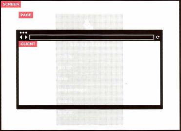

# Forms and JS Events
## Forms:
*HTML borrows the concept of a form to refer to different  elements that allow you to collect information from visitors to  your site.*

### Form Controls
*There are several types of form controls that you can use to collect information from visitors to your site:*
1. Adding text
2. making Choices
3. submitting Forms
4. uploading Files
	
### how Forms Work?
1. A user fills in a form and then presses a button  to submit the information to the server.
2. The name of each form  control is sent to the  server along with the  value the user enters or  selects.
3. The server processes  the information using a  programming language  such as PHP, C#, VB.net,  or Java. It may also store  the information in a  database.
4. The server creates a new  page to send back to the  browser based on the  information received.

### Form structure:
`<form>`
*Form controls live inside a `<form>` element. This element  should always carry the action  attribute and will usually have a method and id attribute too.*

**action**
*Every `<form>` element requires  an action attribute. Its value is the URL for the page on the  server that will receive the  information in the form when it  is submitted.*

**method**
*Forms can be sent using one of  two methods: get or post.*

### text Input

`<input>`
*The `<input>` element is used to create several different form  controls. The value of the type  attribute determines what kind of input they will be creating.*

`type="text"`
*When the type attribute has a value of text, it creates a single line text input.*

`name`
*When users enter information into a form, the server needs to know which form control each piece of data was entered into.*

`size`
*The size attribute should not  be used on new forms. It was  used in older forms to indicate  the width of the text input  (measured by the number of  characters that would be seen)*

`maxlength`
You can use the `maxlength` attribute to limit the number of characters a user may enter into the text field. 

### password Input:
`<input> type="password"`
*When the type attribute has a value of password it creates  a text box that acts just like a  single-line text input, except  the characters are blocked out.*

`name`
*The name attribute indicates  the name of the password input,  which is sent to the server with  the password the user enters.*

`size, maxlength`
*It can also carry the size and `maxlength` attributes like the  single-line text input.*

### text Area:
`<textarea>`
*The `<textarea>` element is used to create a mutli-line text input. Unlike other input  elements this is not an empty  element. It should therefore have an opening and a closing tag.* 

### radio button:
`<input> type="radio"`
*Radio buttons allow users to pick  just one of a number of options.*

`name`
*The name attribute is sent to the server with the value of the option the user selects. When a question provides users with  options for answers in the form  of radio buttons, the value of the name attribute should be the  same for all of the radio buttons  used to answer that question.*

`value`
*The value attribute indicates  the value that is sent to the  server for the selected option.  The value of each of the buttons  in a group should be different  (so that the server knows which  option the user has selected).*

`checked`
*The checked attribute can be  used to indicate which value (if  any) should be selected when  the page loads. The value of this  attribute is checked. Only one  radio button in a group should  use this attribute.*

### Checkbox:
`<input>type="checkbox"`
*Checkboxes allow users to select  (and unselect) one or more options in answer to a question.*

`name`
*The name attribute is sent to the server with the value of the  option(s) the user selects. When a question provides users with  options for answers in the form of checkboxes, the value of the name attribute should be the same for all of the buttons that  answer that question.*

`value`
*The value attribute indicates the value sent to the server if this  checkbox is checked.*

`checked`
*The checked attribute indicates that this box should be checked  when the page loads. If used, its  value should be checked.*

**Conclusion**
*Whenever you want to collect information from  visitors you will need a form, which lives inside a `<form>` element. Information from a form is sent in `name/value` pairs. Each form control is given a name, and the text the  user types in or the values of the options they select  are sent to the server. HTML5 introduces new form elements which make it  easier for visitors to fill in forms.*

## Lists, Tables & Forms
### bullet Point styles(list-style-type)
*The list-style-type property  allows you to control the shape  or style of a bullet point (also  known as a marker). It can be used on rules that  apply to the `<ol>`, `<ul>`, and `<li>`  elements.*

### images For bullets (list-style-image)
*You can specify an image to act as a bullet point using the list-style-image property.*

### Positioning the marker(list-style-position)
*Lists are indented into the page  by default and the list-style-position property indicates  whether the marker should  appear on the inside or the  outside of the box containing the  main points.* 

**This property can take one of  two values:**

1. outside:

*The marker sits to the left of the  block of text. (This is the default  behavior if this property is not  used.)*

2. inside:

*The marker sits inside the box of  text (which is indented).*

**conclusion**
*List markers can be given different appearances using the list-style-type and list-style image  properties.Table cells can have different borders and spacing in  different browsers, but there are properties you can  use to control them and make them more consistent. Forms are easier to use if the form controls are  vertically aligned using CSS. Forms benefit from styles that make them feel more interactive.*

## Events
### EVENT TYPES

### HOW EVENTS TRIGGER JAVASCR IPT CODE ?
1. Select the element node(s) you want the script to respond to. 
2. Indicate which event on the selected node(s) will  trigger the response.
3. State the code you want  to run when the event 
occurs. 

### EVENT FLOW 
*HTML elements nest inside other elements. If you hover or click on a link, you will also be hovering or clicking on its parent elements.*

### WHY FLOW MATTERS?
*The flow of events only really matters when your code has event handlers on an element and one of its ancestor or descendant elements.* 

### WHERE EVENTS OCCUR 
*The event object can tell you where the cursor was positioned when an event was triggered.*

**SCREEN** 
*The screenX and screenY properties indicate the position of the cursor within the entire screen on your monitor, measuring from the top left corner of the screen (rather than the browser).*

**PAGE** 
*The pagex and pageY properties indicate the position of the cursor within the entire page. The top of the page may be outside of the viewport so even if the cursor is in the same position, page and client coordinates can be different.*

**CLIENT** 
*The clientx and clientY properties indicate the position of the cursor within the browser's viewport. If the user has scrolled down and the top of the page is no longer in view, it will not affect the client coordinates.* 

**Conclusion**
*Events are the browser's way of indicating when  something has happened (such as when a page has  finished loading or a button has been clicked). Binding is the process of stating which event you are  waiting to happen, and which element you are waiting  for that event to happen upon. When an event occurs on an element, it can trigger a JavaScript function. When this function then changes  the web page in some way, it feels interactive because  it has responded to the user. You can use event delegation to monitor for events  that happen on all of the children of an element. The most commonly used events are W3C DOM  events, although there are others in the HTMLS  specification as well as browser-specific events.*
 

