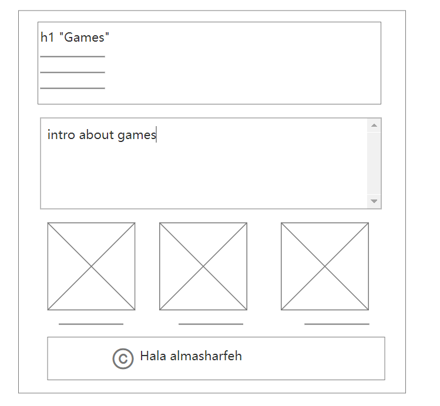
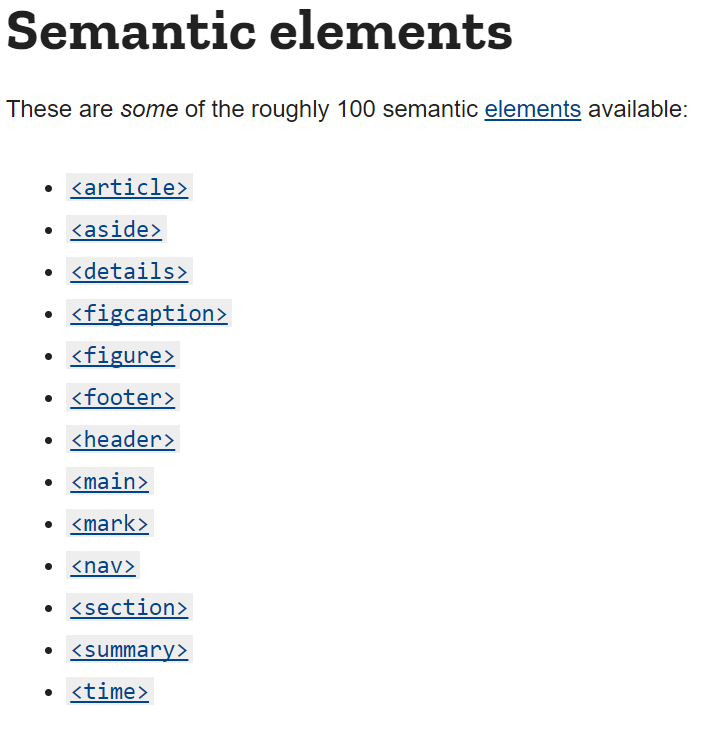

# what is the Wireframe and Design:
*Wireframing is a UX design technique that helps designers to establish and organize the information hierarchy of a website, app, or product. Based on the user research conducted by the UX design team, this approach focuses on how the designer or client wants the user to digest information on a site.
Before constructing anything with code, you need to know where all the information is going to go in clear black and white schematics when designing for the screen. Through the placement of buttons and choices on the diagrams, wireframing is also a fantastic approach to learn how a user interacts with your interface.
Wireframing allows you to arrange the structure and interactivity of your interface without the distractions of colors, typefaces, or text. One popular justification for wireframing is that if a user can't figure out where to go on a simple hand-drawn sketch of your web page, it doesn't matter what colors or fancy typography you use afterwards. Even if it isn't brightly colored or flashing, a button or call to action must be obvious to the user.*
### example of website wireframe:

*Wireframes created on paper with a pencil or on a whiteboard have the advantage of appearing and being very easy to alter, which may be quite useful during early discussions about your website or product.
You may test with end users at every step of ideation and design using paper prototypes. Adjustments made at this stage are more easier—and hence less expensive—than changes made after coding has begun.
After hand-drawing your wireframe, switching to software later helps you to keep track of more detailed judgments.*

### after doing the wireframe we have to start writing the code with HTML

## **What is HTML?**
*HTML (Hypertext Markup Language) is the coding that organizes a web page's structure and content. Content might be organized using paragraphs, a list of bulleted points, or pictures and data tables.
HTML is a markup language that specifies how your material is organized. HTML is made up of a set of components that you may employ to enclose or wrap certain portions of your content to make it seem or function a specific manner. The surrounding tags can be used to make a word or picture hyperlink to another location, italicize words, change the font size, and so on.*
### the Anatomy of an HTML element:

1. The opening tag is made up of the element's name (in this example, p) enclosed in opening and closing angle brackets. This specifies the point at which the element begins to take effect — in this example, the beginning of the paragraph.

2. The closing tag: This is the same as the opening tag, but the element name is preceded by a forward slash. This specifies the point at which the element — in this example, the paragraph — comes to an end. One of the most common beginning mistakes is failing to add a closing tag, which might result in unexpected outcomes.

3. The content: This is the element's content, which is text in this example.

4. The element: The element is made up of the opening tag, the closing tag, and the content.

## what is Semantics:
*Semantics refers to the meaning of a piece of code in programming, such as "what impact does running that line of JavaScript have?" or "what purpose or role does that HTML element have?" (rather than "what does it look like?").*

+ #### **JavaScript semantics**
*Consider a function in JavaScript that accepts a string as a parameter and returns a li> element with that string as its textContent. If the function was named build('Peach') or createLiWithContent('Peach'), would you need to look at the code to figure out what it did?*

+ #### **In CSS, semantics are used.**
*Consider designing a list using li components that represent various varieties of fruits with CSS. Would you know where in the DOM div > ul > li, or.fruits item, is being selected?*

+ #### **HTML's semantics**
*The h1> element in HTML, for example, is a semantic element that assigns to the text it wraps the role (or meaning) of "a top level heading on your website."*

### Mozilla HTML Docs:
*HTML is an acronym for HyperText Markup Language.
HTML (HyperText Markup Language) is the most fundamental component of the Internet. It establishes the structure and meaning of web content. Other technologies are commonly used to describe a web page's appearance/presentation (CSS) or functionality/behavior (JS) in addition to HTML (JavaScript).
The term "hypertext" refers to connections that connect online pages inside a single website or between websites. Links are an important part of the Internet. You become an active participant in the World Wide Web by posting material to the Internet and linking it to other people's pages.*

*HTML uses "markup" to annotate text, images, and other content for display in a Web browser. HTML markup includes special "elements" such as `<head>`,` <title>`, `<body>`, `<header>`, `<footer>`, `<article>`, `<section>`, `
`, `
`, ``, ``, `<aside>`, `<audio>`, `<canvas>`, `<datalist>`, `
`, `<embed>`, `<nav>`, `<output>`, `<progress>`, `<video>`, `<ul>`, `<ol>`, `<li>` and many others.*

