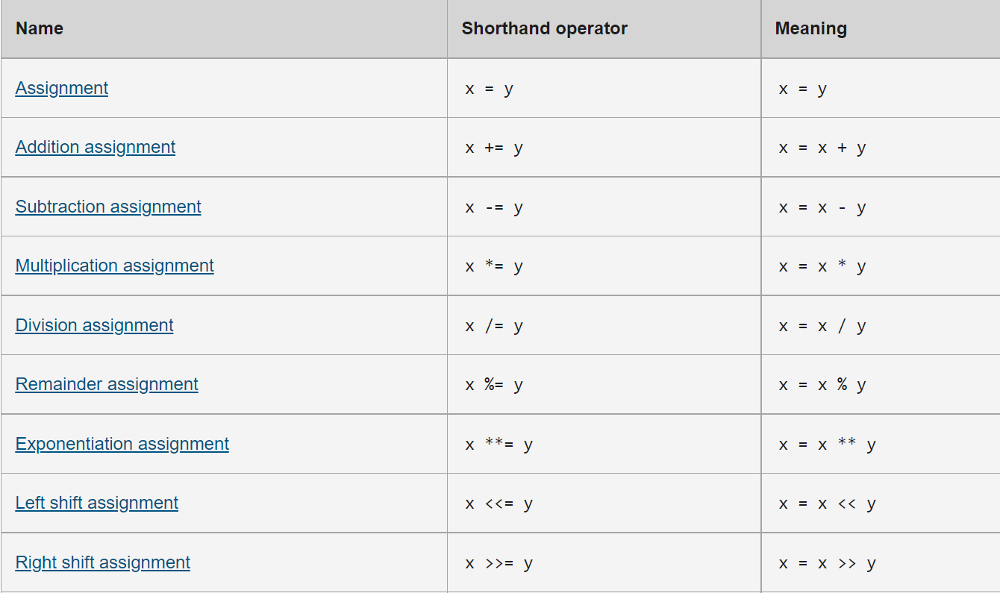

# Expressions and operators:
### **JavaScript have many types of operators:**
+ Assignment operators
+ Comparison operators
+ Arithmetic operators
+ Bitwise operators
+ Logical operators
+ String operators
+ Conditional (ternary) operator
+ Comma operator
+ Unary operators
+ Relational operators

#### The conditional operator is a particular ternary operator in JavaScript. It has both binary and unary operators. Two operands are required for a binary operator, one before and one after it:

*`operand1 operator operand2`*
##### as example:
##### 2*2 or w+y

#### A single operand, either before or after the operator, is required for a unary operator:
*`operator operand`* or *`operand operator`*
##### as example:
##### ++x or x++

* ### Assignment operators:
*Based on the value of its right operand, an assignment operator assigns a value to its left operand. Equal (=) is a simple assignment operator that assigns the value of its right operand to the left operand. x = y, in other words, assigns the value of y to x.*
##### example:

### Return value and chaining:
##### Assignments like x = y, like most expressions, have a return value. It may be accessed by assigning or logging the expression:
>const z = (x = y); // Or equivalently: const z = x = y;

>console.log(z); // Log the return value of the >assignment x = y.
>console.log(x = y); // Or log the return value directly.

*The return value corresponds to the expression to the right of the = sign in the table above's "Meaning" column. That is, `(x = y)` returns y, (x += y) returns x + y, `(x **= y)` returns `x ** y`, and so on.
The return value of logical assignments `(x &&= y)`, `(x ||= y)`, and `(x??= y)`, respectively, is the logical operation without the assignment, thus `x && y`, `x || y`, and `x?? y`.
It's worth noting that the return values are always depending on the values of the operands before to the operation.
Each assignment is evaluated right-to-left when chaining these expressions.*

### Destructuring
*The destructuring assignment syntax is a JavaScript expression that allows you to extract data from arrays or objects using a syntax that is similar to how array and object literals are constructed.*
>`var foo = ['one', 'two', 'three'];`

>// without destructuring

>`var one   = foo[0];`

>`var two   = foo[1];`

>`var three = foo[2];`

>// with destructuring

>`var [one, two, three] = foo;`

### Comparison operators
*A comparison operator compares the operands and returns a logical value if the comparison is true. Numerical, string, logical, or object values can be used as operands. Strings are compared using Unicode values and normal lexicographical ordering. If the two operands aren't of the same type, JavaScript will try to transform them to one that is suitable for the comparison. This behavior usually leads in a numerical comparison of the operands. The === and!== operators, which conduct rigorous equality and inequality comparisons, are the only exceptions to type conversion within comparisons. These operators don't try to convert the operands to a type that's compatible with each other.*
>`var var1 = 3;`

>`var var2 = 4;`

##### Example:

### Arithmetic operators:
An arithmetic operator accepts numerical values as operands (either literals or variables) and returns a single numerical value. Addition (`+`), subtraction (`-`), multiplication (`*`), and division (`/`) are the standard arithmetic operators. When used with floating point numbers, these operators function the same way they do in most other programming languages (in particular, note that division by zero produces Infinity).

## Loops:
*There are many different kinds of loops, but they all essentially do the same thing: they repeat an action some number of times. (Note that it's possible that number could be zero!)*

*The various loop mechanisms offer different ways to determine the start and end points of the loop. There are various situations that are more easily served by one type of loop over the others.*

### we will talk about for and while loop 
#### for loop:
*A for loop is a conditional expression that repeats until it evaluates to false. JavaScript's loop is comparable to Java's and C's loops.*
>for ([initialExpression]; [conditionExpression]; [incrementExpression])
  statement

### When a for loop runs, it does the following:
*If there is one, the initializing expression initialExpression is used. Although this phrase is often used to establish one or more loop counters, the syntax allows for any level of complexity. Variables can also be declared using this expression. The expression conditionExpression is tested. The loop statements are executed if conditionExpression is true. The for loop ends if the value of condition is false. (The condition is considered to be true if the condition phrase is missing altogether.)
The statement is carried out. Use a block statement (... ) to group many statements together for execution.
Control is sent back to Step 2.*

## while statement:
*While statements are executed as long as a particular condition evaluates to true, they are called while statements.*
>while (condition)

>  statement

If the `condition` becomes false, the loop's statements will cease running and control will be passed to the statement after the loop.
The condition test happens before the loop's statements are performed. The statement is performed and the condition is tested again if the condition returns true. If the condition returns false, execution will halt and control will be transferred to the while statement.

Use a block statement (... ) to group many statements together for execution.

 >`while (n < 3)` `{`

 > `n++;`

 > `x += n;`

>`}`

