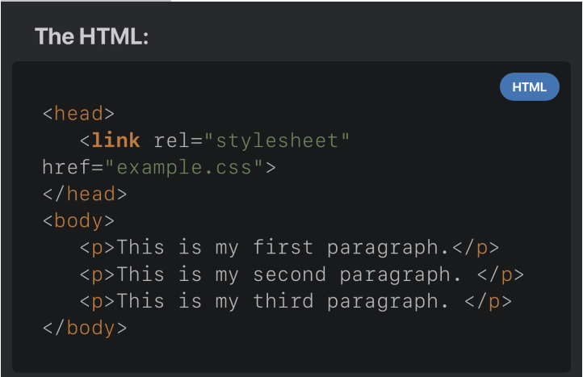
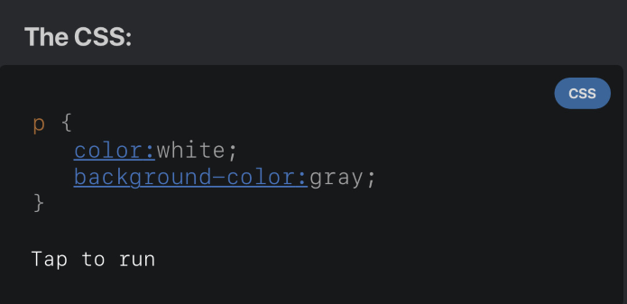

# what is CSS ?
## CSS
 **CSS (Cascading Style Sheets)** *is a declarative language for controlling the appearance of webpages in browsers. To display items properly, the browser applies CSS style declarations to them. The attributes and values that govern how a webpage appears are contained in a style declaration.*

**CSS stands for Cascading Style Sheets.**

+ **Cascading** *refers to the way CSS applies one style on top of another.*
- **Style Sheets** *control the look and feel of web documents.*

**CSS and HTML work hand in hand:**
- HTML sorts out the page structure.
- CSS defines how HTML elements are displayed.


### Why we use CSS?
* *CSS enables you to apply different styles to different HTML components.*
* *it allows you to separate style and content.*
* *All of the styles and formatting are in the same location when using HTML, which makes it harder to manage as the website expands.*

## CSS can be added to HTML documents in 3 ways:
+ ### CSS inline:
*One approach to insert a style sheet is to use an inline style. An inline style is a one-of-a-kind style that is applied to a single element.
In order to use an inline style, add the style attribute to the relevant tag.*

**As example:**
```css 
<p style="color:white; background-color: gray;"  > 
This is an example of inline styling. </p> 
```
+ ### Imbedded internal css :
*Internal styles are defined within the `<style>` element, inside the `<head>` section of an `HTML` page.
An internal style sheet may be used if one single page has a unique style.*

**As example:**
*this  code styles all paragraphs*
```
 
<html> 
<head> 
<style> 
P {
color:white;
Background-color:gray;
} 
</style> 
</head> 
<body>
<p>This is my first paragraph. </p>
<p>This is my second paragraph. </p>
</pody>
< / html > 
```
+ ### External css:

*With this method, all styling rules are contained in a single text file, which is saved with the .css extension. 
This CSS file is then referenced in the HTML using the `<link>` tag. The `<link>` element goes inside the `head` section.*

**as example:**




*Both relative and absolute paths can be used to define the href for the CSS file. In our example, the path is relative, as the CSS file is in the same directory as the HTML file.*

## CSS color Property:
*The color property specifies the color of text.*

**CSS Syntax:**
`color: color|initial|inherit;`

+ **color:** *Specifies the text color. Look at CSS Color Values for a complete list of possible color values.*
+ **initial:** *Sets this property to its default value.*
+ **inherit:** *Inherits this property from its parent element.*


